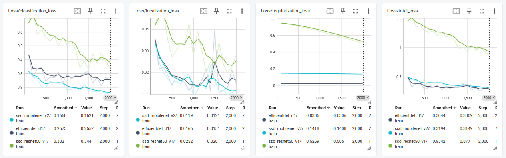
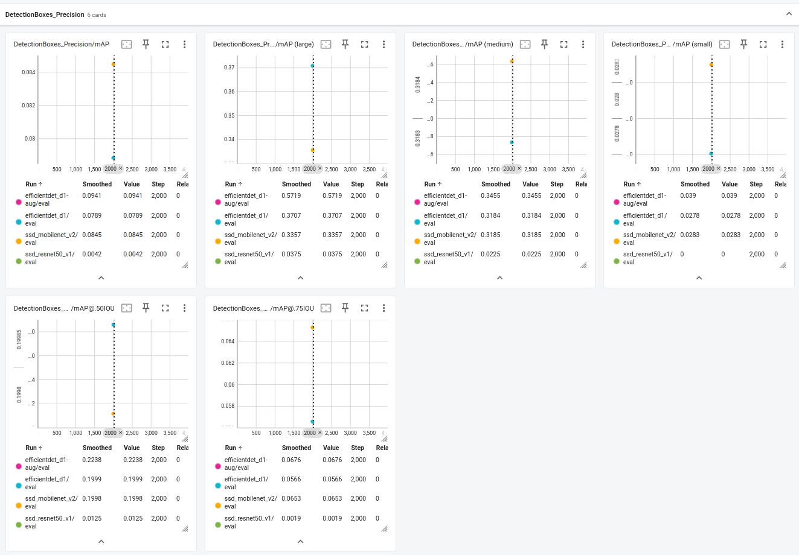
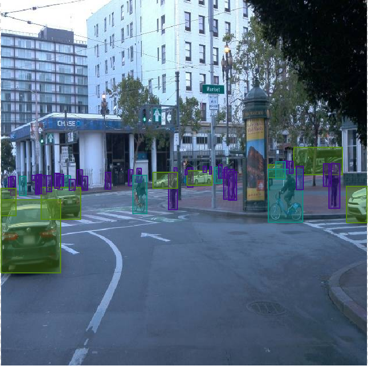

# Report - Object Detection

## Introduction
In this project, we'll be using pretrained models to detect and classify objects using data from Waymo. The dataset provided comprises of urban environments containing annotated cyclists, pedestrians and vehicles. The project primarily uses TensorFlow Object Detection API and performs training and inference in AWS Sagemaker. However, I've also experimented with the Yolov8 Object Detection in my local Ubuntu machine.

Here the final output results on the test video:

efficientdet_d1 model output:

ssd_mobilenet_v2 model output:

## Setup
- Opened the AWS Management Console by clicking on the Launch AWS Gateway button in the classroom.
- Created a notebook instance of type ml.t2.medium in the SageMaker dashboard with the following config.
  - Created a new role under Permissions and encryption, in the IAM role section.
  - Edited the new role to give permissions to Sagemaker, S3, and ECR by attaching AmazonS3FullAccess and AmazonEC2ContainerRegistryFullAccess.
  - Added the git repo GitHub repository link: https://github.com/udacity/cd2688-object-detection-in-urban-environment-project.git.
- Created an S3 bucket for storing model artifacts and logs.

## Tasks
- Model Training
  - Executed the `1_train_model.ipynb` notebook with the default efficientdet_d1_coco17_tpu-32 architecture. This launches the training job and saves the artifacts in S3 at the end of the run. 
  - The pretrained model checkpoints and the pipeline.config files was updated to try other options.
    - The pretrained model checkpoints are available here https://github.com/tensorflow/models/blob/master/research/object_detection/g3doc/tf2_detection_zoo.md
    - The config files are available here - https://github.com/tensorflow/models/tree/master/research/object_detection/configs/tf2
  - Repeated the above step for the ssd_mobilenet_v2_fpnlite_640x640_coco17_tpu-8 architecture. 
  - Repeated the above step for the ssd_resnet50_v1_fpn_640x640_coco17_tpu-8 architecture.
  - Downloaded the tensorboard logs from the S3 bucket and visualized the results.
- Model Inference  
  - Then executed the `2_deploy_model.ipynb` notebook by updating the model_artifact path. This created the inference endpoint and created a video by doing inferences on all 100 frames in the "test_video" folder.
- Exploratory Data Analysis (EDA)
  - Extracted the images and labels in yolo format from the tfrecord files to do some exploration.
  - Visualized the stats in the Supervisely tool to identify outliers and deleted the wrong annotations for pedestrian class in the segment *segment-11252086830380107152_1540_000_1560_000_with_camera_labels_* for yolo model training.
- Yolo Model Training
  - Trained a few yolov8 models for comparison of performance.
  - Visualized the results in Tensorboard.

## Evaluation - TensorFlow Object Detection API

**Loss Metrics**

**How does the validation loss compare to the training loss?**
- Classification Loss: The validation loss for most models seems higher than the training loss, with the exception of SSD MobileNet v2 where they are very close. This could suggest overfitting in the other models.
- Localization Loss: Similar to classification loss, validation loss for all models is generally higher than training loss, again indicating potential overfitting.
- Regularization Loss: This metric is fairly stable across models, with EfficientDet D1 showing a slightly higher training loss than validation. However, the values are close.
- Total Loss: The validation losses are consistently higher than training losses for all models. SSD MobileNet v2 and EfficientDet D1 show closer gaps, whereas SSD ResNet50 v1 shows a significant gap.

**Did you expect such behavior from the losses / metrics?**
- Typically, it's expected that training loss will be lower than validation loss if the model is overfitting. In cases where the training and validation losses are very close, as with SSD MobileNet v2, it suggests good generalization.
- Regularization techniques seem to be working to some degree as indicated by the relatively stable regularization loss across models.

**What can you do to further improve the performance of the tested models?**
- Data Augmentation: This can help in reducing overfitting by increasing the diversity of training data. Techniques such as rotation, translation, scaling, and flipping can be useful.
- Early Stopping: Implementing early stopping to terminate training when validation loss starts to increase consistently can prevent overfitting.
- Hyperparameter Tuning: Adjust learning rates, batch sizes, and other model-specific parameters to optimize performance.
- Regularization Techniques: Increase dropout rates or add L1/L2 regularization if not already in place to help manage overfitting.
- Model Complexity: Especially for SSD ResNet50 v1, consider reducing model complexity if overfitting is too high. Simplifying the model or using a less complex backbone might help.
- Cross-Validation: Utilizing k-fold cross-validation can provide a more robust estimate of model performance and ensure that the model generalizes well across different subsets of data.

**mAP Metrics**

Here are the observations regarding the Mean Average Precision (mAP) across different models:

**Overall mAP**:
- EfficientDet-D1 has the highest overall mAP at around 0.0941.
- SSD MobileNet v2 follows with an mAP of 0.0845.
- The EfficientDet-D1 with data augmentation (aug) has a slightly lower mAP of 0.0789 compared to its original setup.
- SSD ResNet50 v1 has a very low overall mAP at 0.0042.

**mAP for Large Objects**:
- EfficientDet-D1 (both original and augmented) shows very good performance for large objects with mAPs of 0.5719 and 0.3707, respectively.
- SSD MobileNet v2 demonstrates a comparable performance in the augmented model at 0.3357 mAP.
- SSD ResNet50 v1 remains much lower at 0.0375 mAP.

**mAP for Medium Objects**:
- EfficientDet-D1 (original and augmented) shows mAPs of 0.3455 and 0.3184, respectively.
- SSD MobileNet v2 shows a consistent mAP around 0.3185 in both setups.
- SSD ResNet50 v1 again is significantly lower at 0.0225 mAP.

**mAP for Small Objects**:
- All models, including the augmented versions, struggle with small objects.
- EfficientDet-D1 maintains the highest mAP for small objects at 0.039 (original) and 0.0278 (augmented).
- SSD MobileNet v2 has an mAP of 0.0283 in both configurations.
- SSD ResNet50 v1 does not register any detectable performance at 0 mAP.

**mAP at IoU=0.50**:
- EfficientDet-D1 has the best performance at this threshold with 0.2238 mAP for the original and 0.1999 mAP for the augmented version.
- SSD MobileNet v2 maintains an mAP of 0.1998 across both setups.
- SSD ResNet50 v1 remains low at 0.0125 mAP.

**mAP at IoU=0.75**:
- EfficientDet-D1 also shows the best performance at a higher IoU threshold with 0.0676 mAP (original) and 0.0566 mAP (augmented).
- SSD MobileNet v2 follows closely with an mAP of 0.0653 in both configurations.
- SSD ResNet50 v1 is extremely low at 0.0019 mAP.

Summary:
- EfficientDet-D1 remains the best performer across most metrics, though it shows a slight drop in mAP when using data augmentation. This could suggest that while augmentation adds robustness, it might slightly degrade performance on the current validation set.
- SSD MobileNet v2 demonstrates good performance, especially given its less complex architecture, and performs consistently well with and without data augmentation.
- SSD ResNet50 v1 struggles significantly across all metrics, particularly with small objects and at higher IoU thresholds, indicating potential issues in model training or architecture unsuitability for the dataset.

## Exploratory Data Analysis (EDA)

Class balance:
- There are 3 annotation classes.
- The vehicles is the predominant class and the cyclist the rare class.
- The number of annotations and area of annotations vary between the classes.

Edge Cases:
- These images have an unusual number of objects or an abnormal class area.

**segment-10072140764565668044_4060_000_4080_000_with_camera_labels_17.jpg** has highest number of 66 vehicle annotations occupying 33.39% of the image by area.

**segment-11070802577416161387_740_000_760_000_with_camera_labels_3.jpg** has the highest number of 44 pedestrian annotations occupying 4.85% of the image by area.

**segment-11718898130355901268_2300_000_2320_000_with_camera_labels_1.jpg** has the highest number of 6 cyclists annotations occupying 2.15% of the image by area.

Object distribution:
- Heatmap chart for every class shows how objects are frequently presented on images in the dataset facilitating detailed exploration and analysis of class annotations. This helps to quickly find outliers, images with an unusual number of objects. 
- Images without annotation:
  - vehicles: 66
  - pedestrians: 944
  - cyclists: 1732
  - all classes: 

Class sizes:
- Class sizes table gives various size properties of objects for every class. This gives an idea to find classes with the smallest or largest objects or understand the size differences between classes.

Data Issues:

**segment-11252086830380107152_1540_000_1560_000_with_camera_labels_6.jpg** has one pedestrian annotation that covers the entire image.

These are few images with similar annotation issues for pedestrain class where the area is unusually high. The error seems to be in one specific segment **segment-11252086830380107152_1540_000_1560_000_with_camera_labels_?**

## Evaluation - Yolo

**mAP Metrics**

Here's a detailed comparison based on the mAP metrics shown:
mAP@0.5:
- YOLOv8-x achieves the highest score at approximately 0.5586.
- YOLOv8-m follows closely with a score of around 0.5583.
- YOLOv8-x with augmentation (aug) has a slightly lower mAP of about 0.5575.

mAP@0.5:0.95:
- YOLOv8-x also leads in this more stringent mAP metric with a score near 0.3666.
- YOLOv8-m posts a similar performance at approximately 0.3623.
- The augmented version of YOLOv8-x scores slightly lower at around 0.3459.

**PR Curve**

The combined mAP for all classes is 0.584 at IoU=0.5, indicating moderate overall effectiveness.

- Vehicle Class: Highest precision across all recall levels, with an mAP of 0.696 at IoU=0.5. This suggests that the model is very reliable in identifying vehicles.
- Pedestrian Class: Lower precision and recall compared to vehicles, with an mAP of 0.544 at IoU=0.5. This indicates less accuracy and a higher rate of missing true pedestrian cases.
- Cyclist Class: The lowest performance with an mAP of 0.512 at IoU=0.5, reflective of both lower precision and recall. The precision drops sharply as recall increases, indicating difficulty in maintaining accuracy with increasing detection thresholds.

**Confusion Matrix**

Vehicle Class:
- Correctly identified vehicles (True Positives): 4049
- False negatives for vehicles (vehicles misclassified as other classes): Very low, showing strong recognition capabilities for this class.
- False positives (other classes misclassified as vehicles): Relatively low, with the majority of errors involving the background class.

Pedestrian Class:
- Correctly identified pedestrians: 1169
- Significant number of false negatives, where many pedestrians are misclassified as background.
- A small number of false positives (3 cases misclassified as vehicles, and a few as cyclists).

Cyclist Class:
- Correctly identified cyclists: 9, which is notably low compared to other classes.
- High false negatives, with many cyclists misclassified as background.
- Small number of cyclists misclassified as vehicles and pedestrians.

Background Class:
- High true negatives, indicating that non-object areas are predominantly well classified.
- However, there are notable false positives where background areas are misclassified as all three object types.

Overall, the model is highly effective at detecting vehicles but struggles with detecting cyclists and, to a lesser extent, pedestrians. The high rate of false negatives for cyclists and pedestrians suggests potential areas for model improvement, possibly through targeted data augmentation, improved feature detection specific to these classes, or refining the classification thresholds. Further tuning and evaluation might be necessary to balance the precision and recall across all classes, especially to enhance the detection capabilities for less accurately identified classes like cyclists.

**Comparison with TensorFlow Models**:
- EfficientDet-D1 achieved the best mAP@0.5 at around 0.22, but this is significantly lower than the mAP scores seen with the YOLO models 0.586.
- SSD MobileNet v2 and EfficientDet-D1 were competitive in the TensorFlow category but still lower compared to the YOLO models.

**Observations and Insights**:
- YOLOv8 models, across different configurations and even with augmentation, outperform the TensorFlow models significantly in terms of mAP at IoU=0.5 and the more comprehensive mAP from 0.5 to 0.95.
- This difference could be due to various factors, including the inherent design differences between YOLO and the TensorFlow models, where YOLO models are typically more robust and perform better on a variety of tasks due to their architecture and training strategies.
- Data Augmentation tends to slightly reduce precision and mAP metrics in some cases but is likely to improve the model's generalizability to new, unseen data, as evidenced by slightly more robust recall metrics.

Overall, YOLO models show superior performance in both precision and recall compared to the TensorFlow models discussed previously, making them potentially more suitable for applications requiring high accuracy and reliability in object detection.