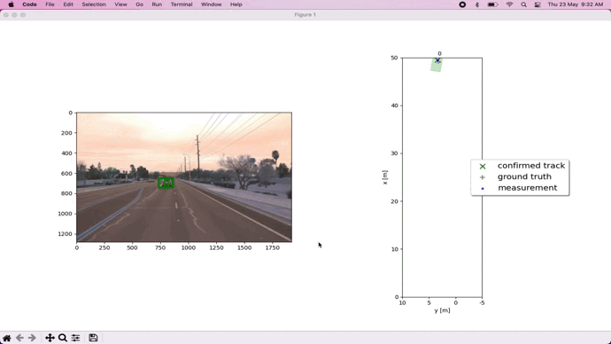
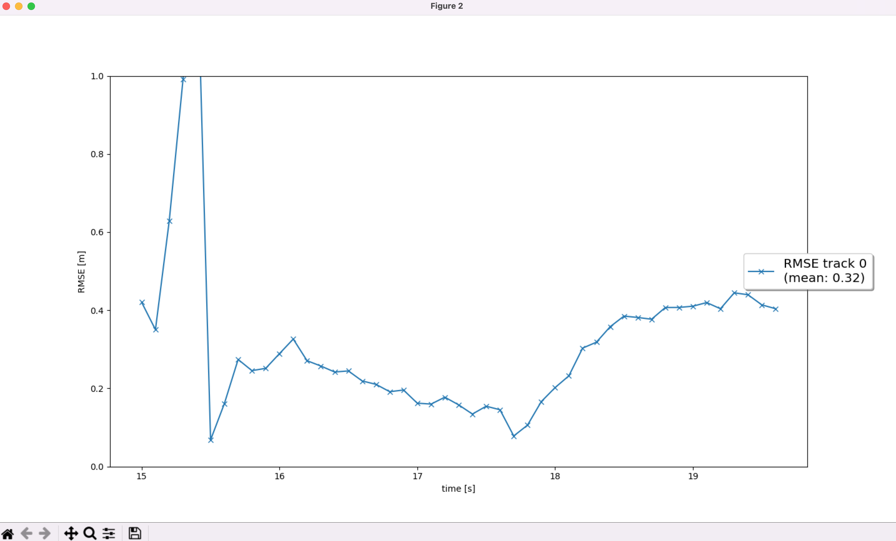
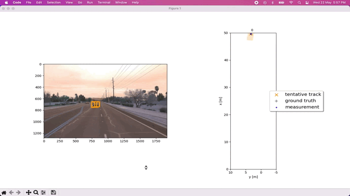
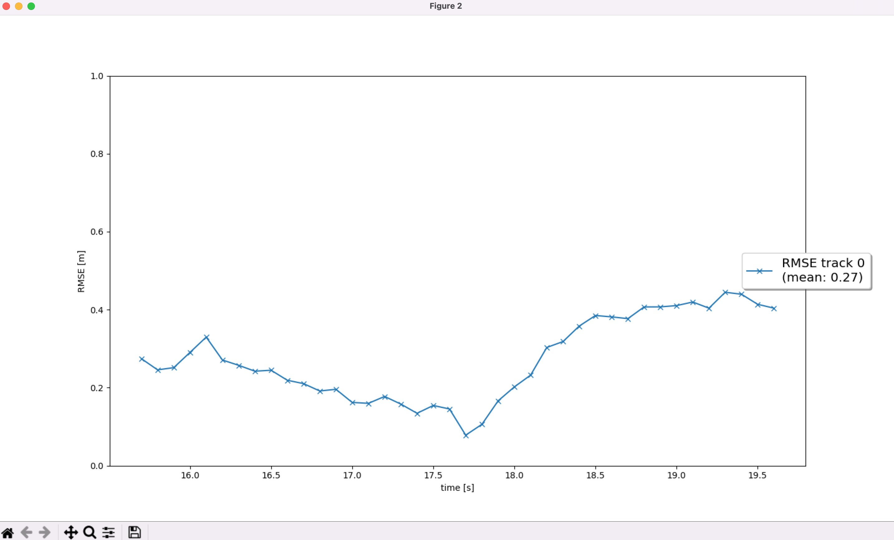
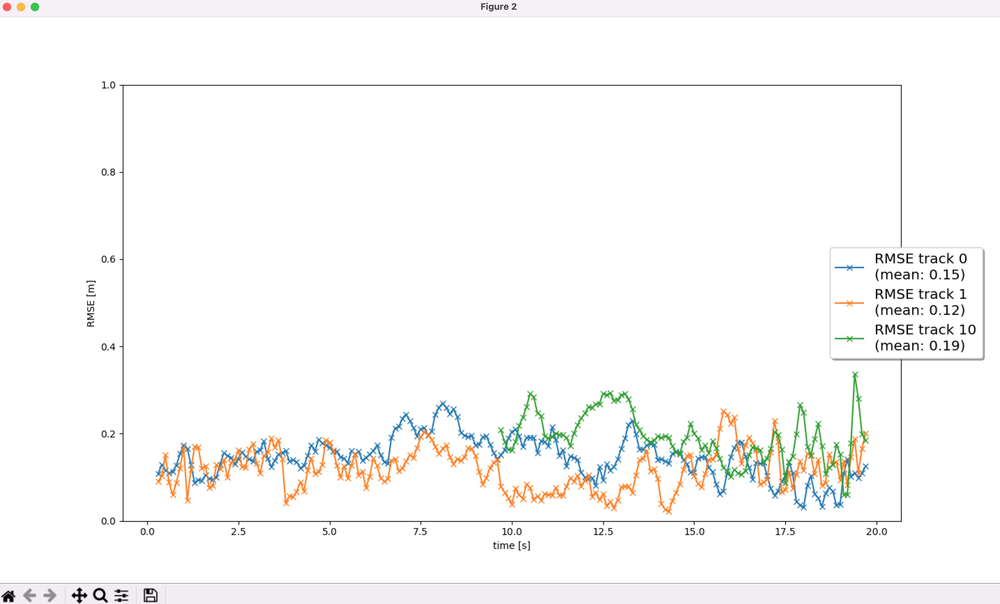
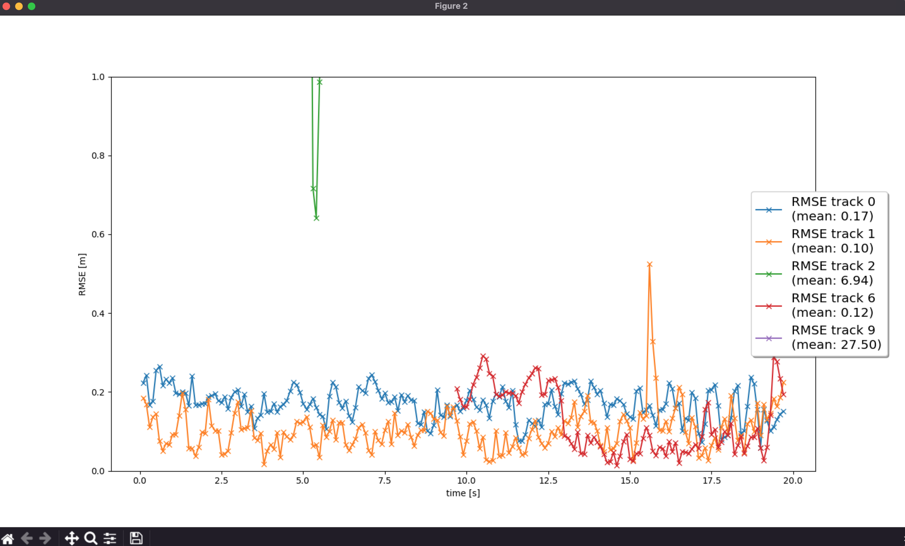

# Report - Final Term

## Introduction

The final project consists of four main steps:
- Step 1: Implement an extended Kalman filter.
- Step 2: Implement track management including track state and track score, track initialization and deletion.
- Step 3: Implement single nearest neighbour data association and gating.
- Step 4: Apply sensor fusion by implementing the nonlinear camera measurement model and a sensor visibility check.

Only Lidar

Both Lidar and Camera

## Setup

- The final project setup uses the same code and data files of the mid term project. 
- But uses pre-computed lidar detections in order for all students to have the same input data. Download the pre-computed lidar detections - https://drive.google.com/drive/folders/1IkqFGYTF6Fh_d8J3UjQOSNJ2V42UDZpO?usp=sharing, unzip them and place them in the folder results.

## Tasks

**Step 1 - Implement an EKF to track a single real-world target with lidar measurement input over time**

- Implemented the `predict()` function for an EKF in `student/filter.py`. Implement the `F()` and `Q()` functions to calculate a system matrix for constant velocity process model in 3D and the corresponding process noise covariance depending on the current timestep dt. Note that in our case, dt is fixed and is loaded from `misc/params.py`. However, in general, the timestep might vary. At the end of the prediction step, the resulting x and P are saved by calling the functions `set_x()` and `set_P()` that are already implemented in `student/trackmanagement.py`.
- Implemented the `update()` function as well as the `gamma()` and `S()` functions for residual and residual covariance. Invoked the functions `get_hx` and `get_H` that are already implemented in students/measurements.py to get the measurement function evaluated at the current state, h(x), and the Jacobian H. Note that we have a linear measurement model for lidar, so `h(x)=H*x`. The resulting x and P are saved by calling the functions `set_x()` and `set_P()` that are already implemented in `student/trackmanagement.py`.

Note that there is no running track management yet, therefore the track state is fixed at 'confirmed' and the score remains at the initial value zero.

The RMSE plot shows a mean RMSE of 0.32 for the range of frames [150,200] in Sequence 2.

**Step 2: Implement the track management to initialize and delete tracks, set a track state and a track score.**

- Replaced the fixed track initialization values in the `Track` class, by initialization of `track.x` and `track.P` based on the input meas, which is an unassigned lidar measurement object of type Measurement. Transformed the unassigned measurement from sensor to vehicle coordinates with the `sens_to_veh` transformation matrix implemented in the `Sensor` class. Initialized the track state with 'initialized' and the score with 1./params.window, where window is the window size parameter.
- Implemented the `manage_tracks()` function in the `Trackmanagement` class to complete the following tasks:
  - Decrease the track score for unassigned tracks.
  - Delete tracks if the score is too low or P is too big.
- Implemented the `handle_updated_track()` function in the Trackmanagement class to complete the following tasks:
  - Increase the track score for the input track.
  - Set the track state to 'tentative' or 'confirmed' depending on the track score.

The visualization shows that a new track is initialized automatically where unassigned measurements occur, the track starts as a tentative track and is confirmed after a few seconds.

There is one single track without track losses in between, so the RMSE plot shows a single line. The plot shows a mean RMSE of 0.27 for the entire range of frames [150,200] like the previous task in Sequence 2.

**Step 3: Implement a single nearest neighbor data association to associate measurements to tracks**

- Implemented the `associate()` function in the Association class to complete the following tasks:
  - Replaced association_matrix with the actual association matrix based on Mahalanobis distances for all tracks in the input track_list and all measurements in the input meas_list Used the `MHD()` function to implement the Mahalanobis distance between a track and a measurement. Also, used the `gating()` function to check if a measurement lies inside a track's gate. If not, the function shall return False and the entry in association_matrix will be set to infinity.
  - Updated the list of unassigned measurements `unassigned_meas` and unassigned tracks `unassigned_tracks` to include the indices of all measurements and tracks that did not get associated.
- Implemented the `get_closest_track_and_meas()` function in the Association class to complete the following tasks:
  - Find the minimum entry in association_matrix, delete corresponding row and column from the matrix.
  - Removed corresponding track and measurement from unassigned_tracks and unassigned_meas.
  - Returned this association pair between track and measurement. If no more association was found, i.e. the minimum matrix entry is infinity, returned numpy.nan for the track and measurement.

There are two tracks (0,1) without track losses in between from the start to end, so the RMSE plot shows a two lines for these. A third track (10) is initiated after 10s for the car over taking on the left. From the visualization, it is evident that the association works properly as multiple tracks are updated with multiple measurements. The visualization shows that there are no confirmed “ghost tracks” that do not exist in reality. There may be initialized or tentative “ghost tracks” as long as they are deleted after several frames.

The plot shows a mean RMSE of less than 0.2 for all the three confirmed tracks for the range of frames [0,200] in Sequence 1. The other tentative tracks are ghost tracks and are deleted.

**Step 4: Implement the nonlinear camera measurement model**

- Implemented the function `in_fov()` in the `Sensor` class that checks if the input state vector x of an object can be seen by this sensor. The function returns True if x lies in the sensor's field of view, otherwise False.
- Implemented the function `get_hx()` in the `Sensor` class with the nonlinear camera measurement function h as follows:
  - transform position estimate from vehicle to camera coordinates
  - project from camera to image coordinates
- Removed the restriction to lidar in the function `generate_measurement()` in the `Sensor` class, in order to include camera as well.
- Initialized camera measurement objects in the `Measurement` class including z, R, and the sensor object sensor.

The tracking loop now updates all tracks with lidar measurements, then with camera measurements. The visualization shows that the tracking performs well, again no confirmed ghost tracks or track losses occur. There are two tentative ghost tracks (6,9) that occur briefly and are deleted.

The RMSE plot shows at least three confirmed tracks. Two of the tracks (0,1) are tracked from beginning to end of the sequence (0-200s) without track loss. The mean RMSE for these three tracks (0,1,6) is below 0.25.

## Conclusion

**Do you see any benefits in camera-lidar fusion compared to lidar-only tracking (in theory and in your concrete results)?**

The lower values of the RMSE of the camera-lidar fusion compared to lidar-only tracking indicates indicates better tracking performance. The combination of camera and LiDAR data likely helps in better delineation and tracking of objects, as indicated by the bounding boxes that tightly enclose the vehicles. Also, the number of ghost tracks have reduced compared to lidar only tracking.

These are the benefits in camera-lidar fusion
- **Improved Accuracy and Reliability**: Fusion of camera and LiDAR data generally offers more accurate and reliable tracking because the strengths of one sensor can compensate for the weaknesses of the other. For instance, LiDAR provides precise distance measurements, which is crucial for accurate tracking, while cameras offer rich color information and finer details about the environment which LiDAR cannot capture.
- **Enhanced Object Classification**: Cameras provide detailed visual information that can be crucial for classifying objects. For example, the visual appearance of a vehicle or pedestrian can be more distinctly captured with a camera than with LiDAR. This visual data, combined with the spatial information from LiDAR, enhances the system's ability to classify objects accurately.
- **Robustness in Various Conditions**: Camera and LiDAR sensors complement each other under different environmental conditions. Cameras perform well in conditions with adequate lighting but can struggle in low light or direct sunlight. LiDAR, on the other hand, is less affected by lighting conditions and can provide reliable data in fog, rain, or night-time scenarios.

**Which challenges will a sensor fusion system face in real-life scenarios? Did you see any of these challenges in the project?**

These are the potential challenges faced by a sensor fusion system in real-life scenarios.
- **Sensor Data Quality**: Dependence on the quality of data from sensors, which can be impaired by weather, environmental conditions, and accumulation of dust or dirt.
- **Regular Maintenance and Calibration**: Need for regular maintenance and recalibration due to sensor accuracy drift over time.
- **Ghost Tracks/False Positives**: Presence of ghost tracks or false positives due to sensor over-sensitivity or noise, as observed in the project.
- **Data Misalignment**: Instances of camera and LiDAR data not aligning perfectly, leading to slight mismatches in object boundaries.
- **Processing Delays**: Potential delays in data processing, particularly in scenarios with high dynamic complexity involving many moving objects.
- **Tracking Fast-Moving Objects**: Challenges in tracking objects that move at high speeds or change direction suddenly.

**Can you think of ways to improve your tracking results in the future?**

There are several enhancements and refinements that could be introduced in both the tracking algorithms and in the overall sensor fusion approach.
- **Advanced Data Association Techniques**: Distinguishing between measurements from different objects and correctly associating them to the right track can be challenging, especially in dense scenarios. Implementing a more sophisticated data association techniques such as Global Nearest Neighbor (GNN), Joint Probabilistic Data Association (JPDA), or even Multiple Hypothesis Tracking (MHT) can help manage ambiguities in measurement-to-track assignments more effectively than simpler nearest-neighbor techniques.
- **Adaptive Process Noise**: The fixed process noise might not be suitable for all dynamics, particularly if the tracked objects exhibit varying levels of maneuverability. Utilizing an adaptive process noise model that adjusts based on the observed behavior of the tracks can make the tracking algorithm more responsive to changes in object motion and improve track stability.
- **Improved Sensor Fusion Logic**: In the current setup, we're primarily initializing tracks with LiDAR measurements. While LiDAR provides precise range and position data, it lacks detailed appearance information that cameras offer. Developing a more integrated sensor fusion strategy that uses camera data more effectively alongside LiDAR. For instance, using camera data for initial object detection and classification, then refining and tracking the object's position and motion with LiDAR.
- **Robustness to Environmental Conditions**: Sensors like LiDAR and cameras can be affected differently by various environmental factors such as lighting conditions, weather, and occlusions. Implementing algorithms such as weather-adaptive thresholds or models that can compensate for poor visibility or lighting would be more robust to such variations.
- **Handling Occlusions and Interactions**: Objects may occlude each other or interact in complex ways, making tracking more difficult. Enhancing the system's ability to handle occlusions by predicting potential occlusions based on object trajectories and sizes. Using interaction models to predict how closely spaced objects might affect each other’s movements.
- **Improved Initialization and Deletion Logic**: Incorrect initialization and premature or delayed track deletion can lead to reduced tracking performance. Refining the logic for initializing and deleting tracks. Using more complex criteria for track initialization, possibly including statistical tests to ensure that new tracks are based on reliable data. Similarly, refining the deletion criteria to consider recent trends in the track's quality and prediction confidence, rather than relying solely on fixed thresholds.
- **Enhancing Track Management Code**: Implementing a more dynamic scoring system that not only penalizes for non-detection but also rewards consistent detection more robustly could help in stabilizing the track scores and making the track life-cycle management more reflective of actual tracking conditions.
