# Mid-Term Report

## Project: 3D Object Detection with LiDAR Data

### Intro
In this project, we'll fuse measurements from LiDAR and camera and track vehicles over time. We'll be using real-world data from the Waymo Open Dataset, detect objects in 3D point clouds and apply an extended Kalman filter for sensor fusion and tracking.

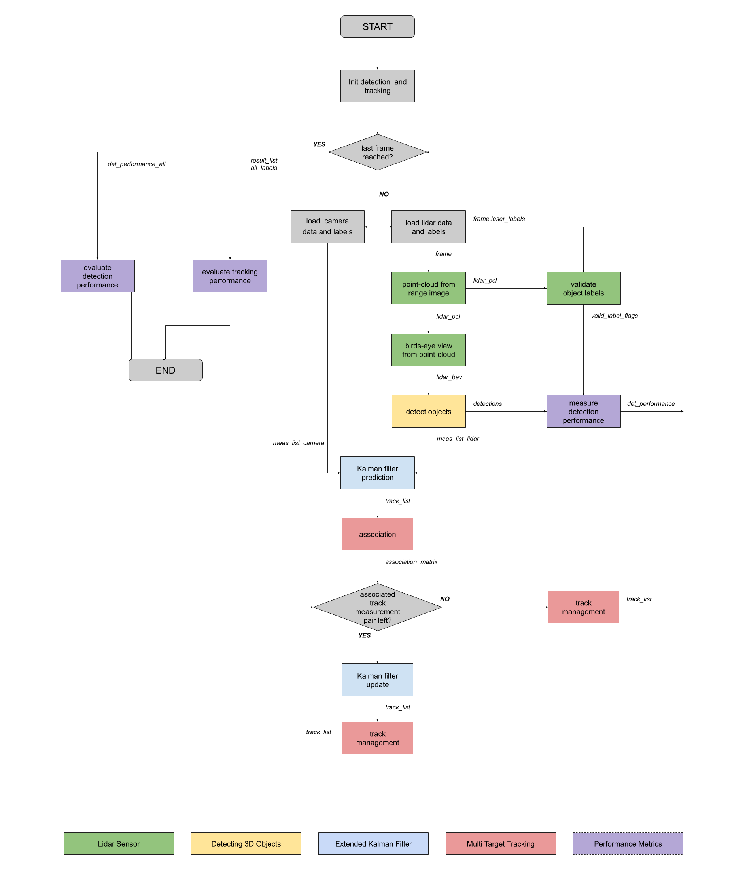
A diagram of all the project pieces combined (both mid-term and final). The midterm project focuses on the Lidar sensor and the 3D Object Detection blocks.

### Setup

The following steps were followed to setup the code base and data.
- Obtained the project files from the related Github repository - https://github.com/udacity/nd013-c2-fusion-starter.
- Installed dependencies in the requirements.txt file
- Registered with Waymo Open Dataset here - https://waymo.com/open/terms
- Downloaded the individual sequences from https://console.cloud.google.com/storage/browser/waymo_open_dataset_v_1_2_0_individual_files
  - Sequence 1 : training_segment-1005081002024129653_5313_150_5333_150_with_camera_labels.tfrecord
  - Sequence 2 : training_segment-10072231702153043603_5725_000_5745_000_with_camera_labels.tfrecord
  - Sequence 3 : training_segment-10963653239323173269_1924_000_1944_000_with_camera_labels.tfrecord
- The object detection methods used in this project use pre-trained models which have been provided by the original authors. Copied the model files into the paths /tools/objdet_models/darknet/pretrained and /tools/objdet_models/fpn_resnet/pretrained respectively.
  - Darknet: https://drive.google.com/file/d/1Pqx7sShlqKSGmvshTYbNDcUEYyZwfn3A/view?usp=sharing
  - FPN Resnet: https://drive.google.com/file/d/1RcEfUIF1pzDZco8PJkZ10OL-wLL2usEj/view?usp=sharing
- Downloaded the pre-computed results from here - https://drive.google.com/drive/folders/1-s46dKSrtx8rrNwnObGbly2nO3i4D7r7?usp=sharing. The contents were unzipped and placed in the results folder.
- Clone the repo Super Fast and Accurate 3D Object Detection based on 3D LiDAR Point Clouds - https://github.com/maudzung/SFA3D. Note that the pre-trained model from SFA3D is already available at tools/objdet_models/resnet.

### Using Pre-Computed Results
In the main file loop_over_dataset.py, the steps of the algorithm to be executed are mentioned. To call a specific function, simply add the corresponding string literal to one of the following lists:
- `exec_data` : controls the execution of steps related to sensor data.
  - `pcl_from_rangeimage` transforms the Waymo Open Data range image into a 3D point-cloud
  - `load_image` returns the image of the front camera
- `exec_detection` : controls which steps of model-based 3D object detection are performed
  - `bev_from_pcl` transforms the point-cloud into a fixed-size birds-eye view perspective
  - `detect_objects` executes the actual detection and returns a set of objects (only vehicles)
  - `validate_object_labels` decides which ground-truth labels should be considered (e.g. based on difficulty or visibility)
  - `measure_detection_performance` contains methods to evaluate detection performance for a single frame
- `exec_tracking` : controls the execution of the object tracking algorithm
- `exec_visualization` : controls the visualization of results
  - `show_range_image` displays two LiDAR range image channels (range and intensity)
  - `show_labels_in_image` projects ground-truth boxes into the front camera image
  - `show_objects_and_labels_in_bev` projects detected objects and label boxes into the birds-eye view
  - `show_objects_in_bev_labels_in_camera` displays a stacked view with labels inside the camera image on top and the birds-eye view with detected objects on the bottom
  - `show_tracks` displays the tracking results
  - `show_detection_performance` displays the performance evaluation based on all detected
  - `make_tracking_movie` renders an output movie of the object tracking results

If a specific step into the list, pre-computed binary files will be loaded instead. This enables to run the algorithm and look at the results even without having implemented anything yet. 

### Tasks

**Section 1 : Compute Lidar Point-Cloud from Range Image**

1.1. Visualize range image channels (ID_S1_EX1):

In the Waymo Open dataset, lidar data is stored as a range image. Therefore, this task is about extracting two of the data channels within the range image, which are "range" and "intensity", and convert the floating-point data to an 8-bit integer value range. And finally the OpenCV library was used to stack the range and intensity image vertically and visualize it.
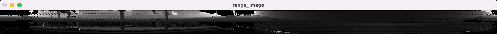

Identify vehicle features that appear as a stable feature on most vehicles

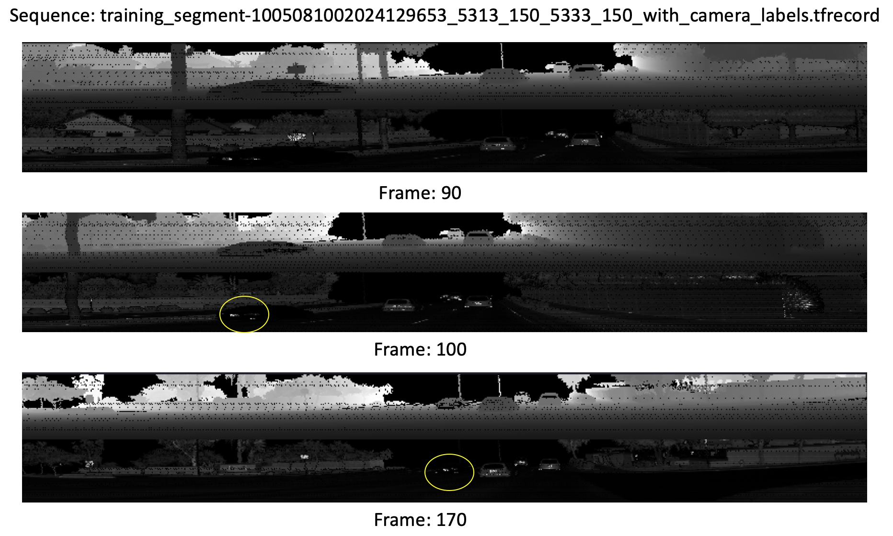
Here is clear that the tail lights, number plate are clearly visible on vehicles that are ahead. Other features like bumper, body, etc are visible on vehicles that are close by. Other objects like road surface appear pitch black. This indicates that the light reflect off of different surfaces return the light beam with varying intensities which can be observed in the lidar range image. Also colour of the vehicle seems to matter. Note the car circled in yellow, appears to have a darker body compared to others.

1.2. Visualize lidar point-cloud (ID_S1_EX2):

The goal of this task is to use the Open3D library to display the lidar point-cloud in a 3d viewer in order to develop a feel for the nature of lidar point-clouds. The output is a 3D image that can be translated and rotated. The mouse and keyboard controls are mentioned in the documentation here - https://www.open3d.org/docs/0.12.0/tutorial/visualization/visualization.html
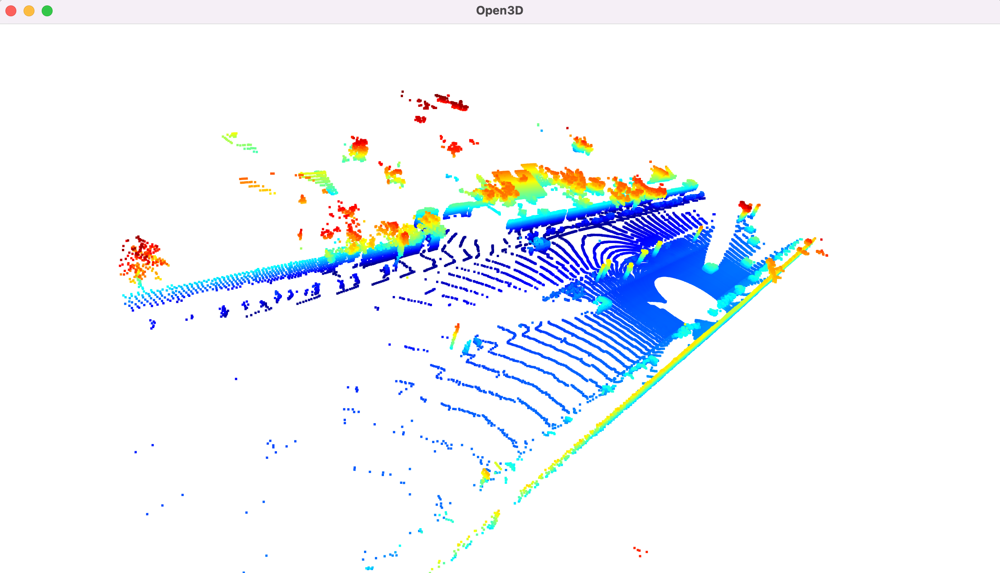

Find and display examples of vehicles with varying degrees of visibility in the point-cloud

The following features are observed in general.
- **Wheels**: The circular shapes at the bottom of each car representation are the wheels. In a point cloud, these are usually seen as distinct circles or partial circles, depending on the angle from which the LiDAR has captured the data. Wheels are crucial features for identifying vehicles in point clouds because they are consistent in shape and relative position across different vehicle types.
- **Rounded Front and Rear Ends**: The rounded shapes at the ends of each vehicle suggest the contour of the car's front (hood and bumper) and rear (trunk and rear bumper). This curvature is typical in many car designs, contributing to aerodynamics and aesthetic appeal. In point clouds, these parts might appear more or less rounded depending on the specific model of the car and the resolution of the LiDAR scan.
- **Body Shape and Size**: The overall body shape can be identified, with the top line representing the roof and the sides indicating the doors and windows. The body shape helps distinguish different types of vehicles (e.g., sedan, SUV, hatchback).
- **Spacing and Alignment**: The spacing between the wheels and their alignment provide additional information about the size and type of the vehicle. For instance, a larger distance between the front and rear wheels often indicates a longer vehicle, which could be a sedan or an SUV.

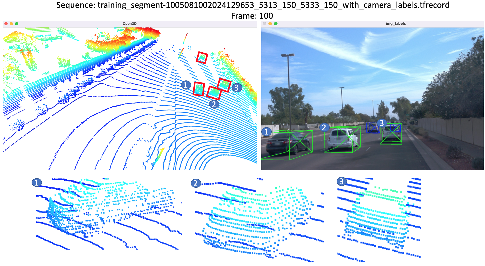

From this frame we can observe several features that distinguish the three cars - wheels, rounded front and rear ends and body shape.

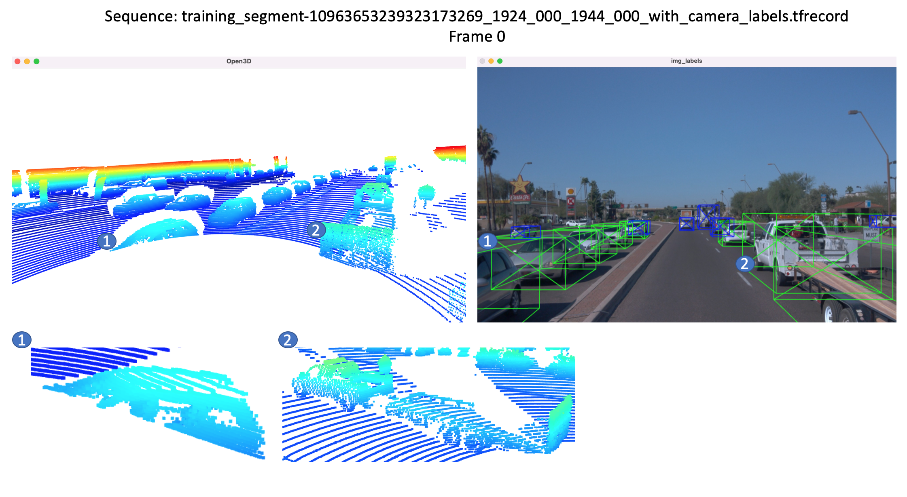

From this frame you can observe the partial shape of the car passing in the opposite lane on the left and the SUV hauling a flat bed trailer.

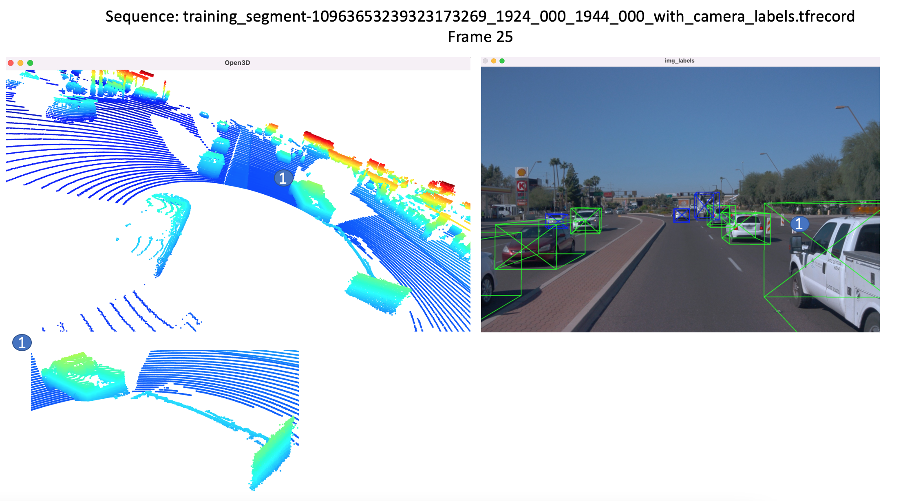

From this frame you can observe that the flat bed trailer is only partially visible when the ego car is travelling beside it. This can be mistaken for empty space.

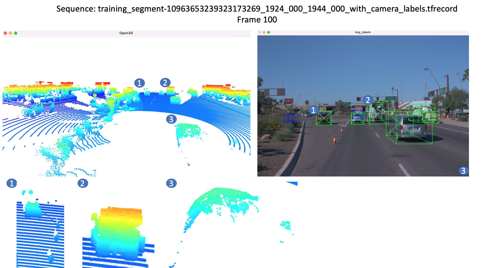

From this frame you can observe that the car1 is actually facing in the opposite direction to the flow of traffic and is seperated by the traffic cones. But it is hard to discern the direction from the point cloud. Also taller vehicles like trucks have a different bright colour which can be used to identify it. Also the car3 that is not visible in the camera feed is partially visible in the pcl image and it is difficult to discern the type of the vehicle from this.

**Section 2 : Create Birds-Eye View from Lidar PCL**

2.1. Convert sensor coordinates to BEV-map coordinates (ID_S2_EX1):

The goal of this task is to perform the first step in creating a birds-eye view (BEV) perspective of the lidar point-cloud. Based on the (x,y)-coordinates in sensor space, computed the respective coordinates within the BEV coordinate space so that in subsequent tasks, the actual BEV map can be filled with lidar data from the point-cloud.
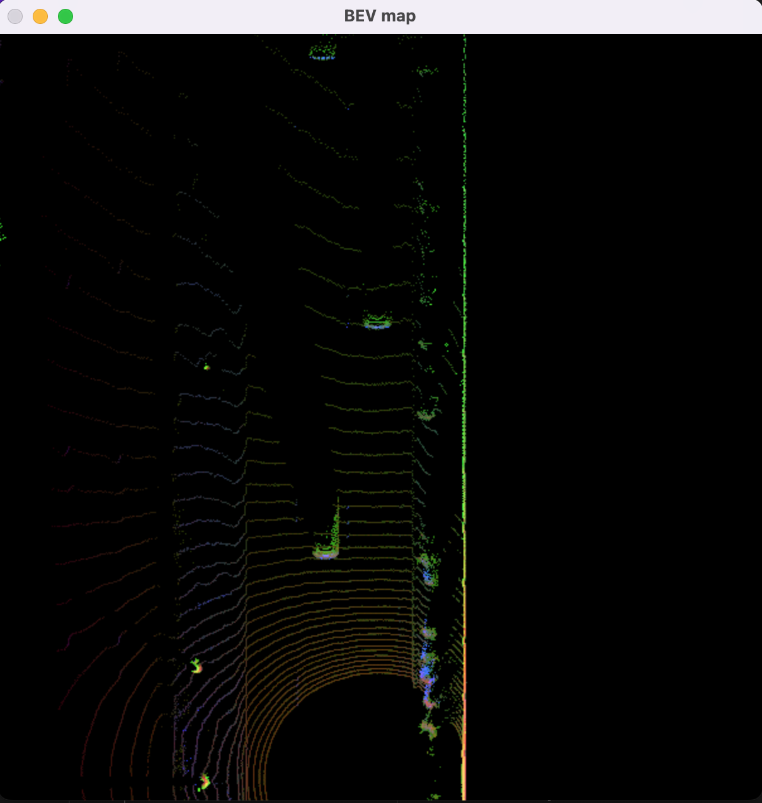

2.2. Compute intensity layer of the BEV map (ID_S2_EX2):

The goal of this task is to fill the "intensity" channel of the BEV map with data from the point-cloud. Identified all points with the same (x,y)-coordinates within the BEV map and then assign the intensity value of the top-most lidar point to the respective BEV pixel. Also, normalized the resulting intensity image using percentiles, in order to make sure that the influence of outlier values (very bright and very dark regions) is sufficiently mitigated and objects of interest (e.g. vehicles) are clearly separated from the background.
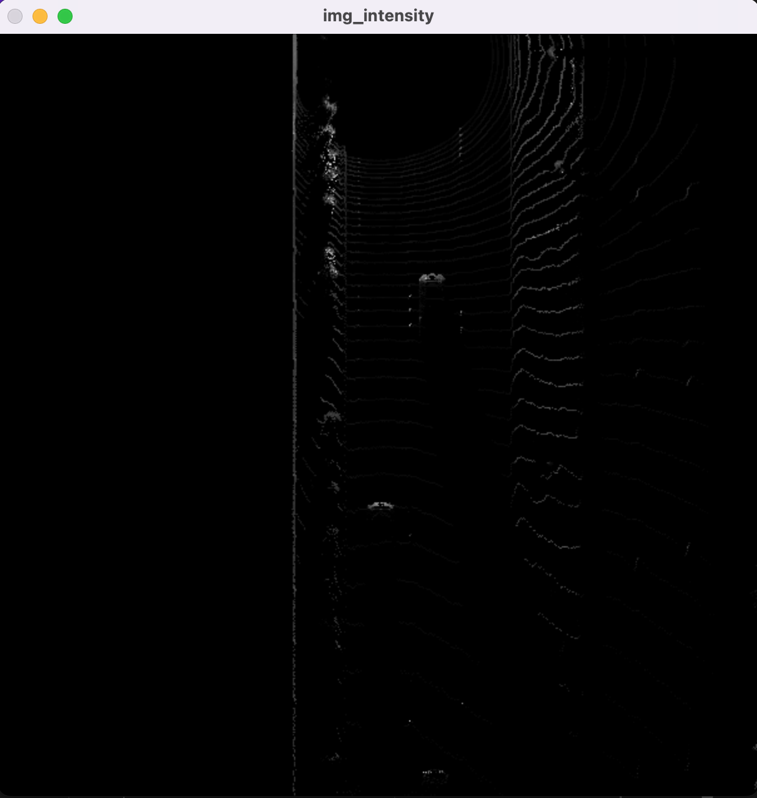

2.3. Compute height layer of the BEV map (ID_S2_EX3):

The goal of this task is to fill the "height" channel of the BEV map with data from the point-cloud. Use of the sorted and pruned point-cloud from the previous task and normalize the height in each BEV map pixel by the difference between max. and min. height which is defined in the configs.
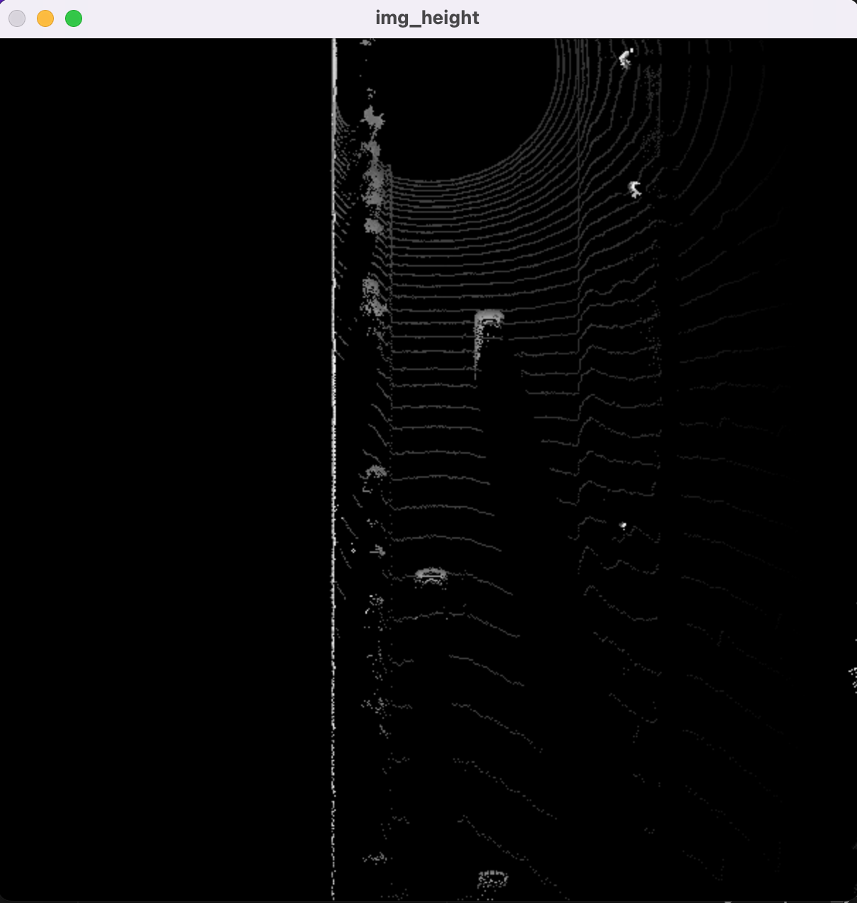

**Section 3 : Model-based Object Detection in BEV Image**

3.1. Add a second model from a GitHub repo (ID_S3_EX1):

The model-based detection of objects in lidar point-clouds using deep-learning is a heavily researched area. Object detection algorithms such as Complex-YOLO: Real-time 3D Object Detection on Point Clouds and Super Fast and Accurate 3D Object Detection based on 3D LiDAR Point Clouds will be used in this project. As part of the setup the SFA3D repo was cloned and the configs were setup.

3.2 Extract 3D bounding boxes from model response (ID_S3_EX2):

As the model input is a three-channel BEV map, the detected objects will be returned with coordinates and properties in the BEV coordinate space. Thus, before the detections can move along in the processing pipeline, they need to be converted into metric coordinates in vehicle space. This task is about performing this conversion such that all detections have the format [1, x, y, z, h, w, l, yaw], where 1 denotes the class id for the object type vehicle.

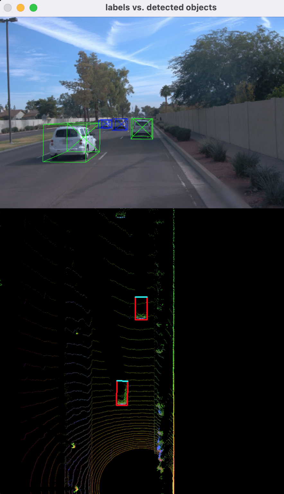

**Section 4 : Performance Evaluation for Object Detection**

4.1. Compute intersection-over-union between labels and detections (ID_S4_EX1):

The goal of this task is to find pairings between ground-truth labels and detections, so that we can determine wether an object has been (a) missed (false negative), (b) successfully detected (true positive) or (c) has been falsely reported (false positive). Based on the labels within the Waymo Open Dataset, the task is to compute the intersection over union (IOU) between the bounding boxes of labels and detected objects and determine the percentage of this overlap in relation to the area of the bounding boxes.

4.2 Compute false-negatives and false-positives (ID_S4_EX2):

Based on the pairings between ground-truth labels and detected objects, the goal of this task is to determine the number of false positives and false negatives for the current frame. After all frames have been processed, an overall performance measure will be computed based on the results produced in this task.

4.3 Compute precision and recall (ID_S4_EX3):

After processing all the frames of a sequence, the performance of the object detection algorithm shall now be evaluated. To do so in a meaningful way, the two standard measures "precision" and "recall" will be used, which are based on the accumulated number of positives and negatives from all frames.

I got the results as precision = 0.9438775510204082, recall = 0.75 for the sequence `training_segment-1005081002024129653_5313_150_5333_150_with_camera_labels.tfrecord` and frames [0,200].

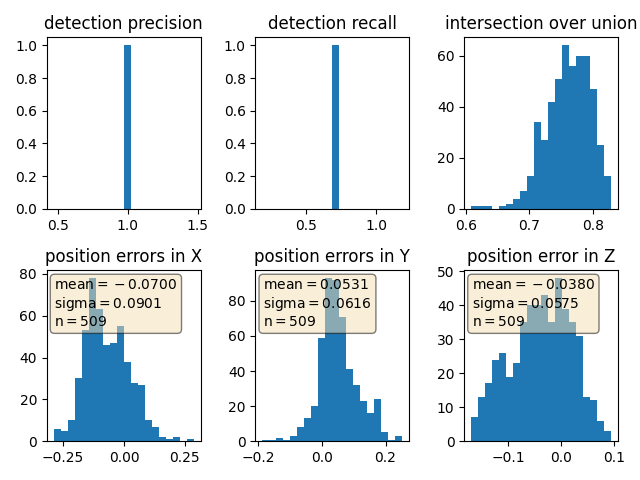