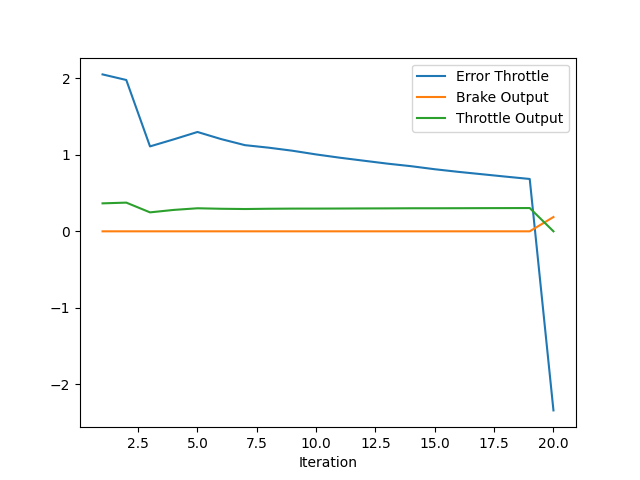

## Report

Before Finetuning

After Finetuning

1. Add the plots to the report and explain them (describe what you see)
2. What is the effect of the PID according to the plots, how each part of the PID affects the control command?

I started the initialization of the PID values based on the post here - https://knowledge.udacity.com/questions/939702. Then tuned the steering and throttle PID values based on the analysis of the plot outputs from each iteration.

Throttle PID response - Before Tuning

Throttle PID response - After Tuning

The graph presents data on throttle error and the corresponding outputs for brake and throttle over 20s, illustrating the impact of tuning the PID controller settings on system performance. Key observations and adjustments made were as follows:

- **Proportional Gain (Kp)**: The initial sharp decrease in throttle error (blue line) indicates that the proportional gain was effective in reducing error, but the subsequent fluctuations suggest that it might be set too high, leading to potential overshoot. Adjusting Kp down from 0.21 to 0.15 helped stabilize these oscillations and improved the system's response.
- **Derivative Gain (Kd)**: The presence of sharp spikes in the throttle output (green line) pointed to a need for better damping of the system's response to changes in error. Increasing the derivative gain from 0.080 to 0.02 helped smooth out the response, effectively reducing these spikes and providing a more consistent throttle output.
- **Integral Gain (Ki)**: Initially set at 0.0006, the integral gain appeared to be relatively high in proportion to Kp, which could lead to overcorrections and instability due to accumulated error. Lowering Ki to 0.0025 minimized the overshoot and improved the steady-state performance of the throttle system.

These adjustments to the PID controller parameters aimed to balance the immediate response to error (Kp), the rate of change in error (Kd), and the accumulation of past errors (Ki), resulting in more stable and predictable control of the throttle and brake outputs. The final settings show a marked improvement in reducing the throttle error over iterations, with both brake and throttle outputs stabilizing, indicating a successful tuning of the system.

Steering PID response - Before Tuning

Steering PID response - After Tuning

The plot illustrates the relationship between error in steering and the steering output across 20s, providing insight into the effectiveness and tuning of the PID controller parameters. From the initial analysis, it was evident that certain adjustments were necessary:

- **Proportional Gain (Kp)**: Initially set at 0.21, the high proportional gain was causing significant oscillations in the steering output, as seen in the fluctuations around iteration numbers 5, 10, and 15. A reduction in Kp to 0.14 helped in smoothing out these oscillations, leading to a less erratic steering response.
- **Derivative Gain (Kd)**: The derivative component, originally at 0.080, plays a crucial role in stabilizing the system by dampening the rate of change in error. An increase in Kd to 0.02 provided more immediate corrections to sharp steering changes, notably improving stability and response sharpness during rapid changes in error around iterations 12 to 20.
- **Integral Gain (Ki)**: The analysis indicated that the integral gain, initially at 0.0006, might have been too high given the flat nature of the error steering curve, suggesting minimal accumulation of error over time. Lowering Ki to 0.014 reduced its impact, thereby diminishing any undue integral influence that might contribute to overcorrection and instability in steering output.

The adjustments made to the PID controller—lowering Kp and Ki while increasing Kd—were based on observed system behaviors and aimed at achieving a more controlled and stable steering response. This refinement led to improved steering performance as evidenced by the closer alignment of the steering output with the desired trajectory in later iterations.

Trajectory - Before Tuning

Trajectory - After Tuning

The provided plots display a comparison of the intended waypoint trajectory and the actual trajectory followed by a car, alongside a chart of the car's velocity over time. The Trajectory Comparison plot reveals that while the actual trajectory (orange dashed line) closely mirrors the intended waypoint trajectory (blue line), there are noticeable deviations. These discrepancies suggested potential issues in how the closest waypoints were being calculated. 

This misalignment in waypoint calculation could lead to sharp and sudden changes in steering direction. To address this, I modified the algorithm to ensure that only waypoints ahead of the car's current position are considered. This adjustment provided a more accurate and predictive steering response, smoothing out the trajectory and aligning it more closely with the planned path.

The Car Velocity Over Time plot shows a rapid acceleration to a stable velocity of approximately 2.5 m/s, indicating that the car quickly reached and maintained its target speed without further fluctuations. This consistency in speed supports the effectiveness of the vehicle's acceleration and speed control mechanisms.

3. How would you design a way to automatically tune the PID parameters?
The first step would be to establish the criteria for the tuning process and define what "optimal" means in the context of the system. This may include minimal overshoot, quick settling time, minimal steady-state error, and robustness to disturbances.
Next step is to choose an algorithm for the tuning process. Brute force approaches (for e.g. twiddle exercise) tend to be time consuming and not feasible for coomple systems involving mutiple PID loops compared to heuristics. There are several heuristic algortithms can help to automatically tune the PID parameters.
- Ziegler-Nichols Method
- Cohen-Coon Method
- Genetic Algorithms
- Particle Swarm Optimization (PSO)
- Gradient Descent
These approaches can be explored further as a next step.

4. PID controller is a model free controller, i.e. it does not use a model of the car. Could you explain the pros and cons of this type of controller?
Pros of PID Controllers:
- **Simplicity**: PID controllers are relatively simple to understand and implement, making them a popular choice for many engineers, especially in applications where a precise control model is difficult to develop.
- **Versatility**: They can be applied across a wide range of industries and systems, from simple household appliances to complex industrial processes.
- **Robustness**: PID controllers are known for their robust performance in a variety of operating conditions, particularly where system dynamics do not change drastically over time.
- **No Need for System Model**: The PID controller does not require a mathematical model of the process it is controlling, which simplifies setup and reduces the effort and expertise required to implement control systems.
- **Cost-Effectiveness**: Due to their simplicity, PID controllers can be implemented without the high costs associated with developing and validating a process model.

Cons of PID Controllers:
- **Performance Limitations**: Without a model, PID controllers might not handle complex dynamics or nonlinear systems as effectively as model-based controllers. They are best suited for systems where the relationship between input and output is relatively straightforward and linear.
- **Tuning Challenges**: Finding the optimal PID parameters (Kp, Ki, Kd) can sometimes be difficult, especially in systems with variable dynamics. Poor tuning can lead to performance issues such as overshoot, prolonged settling times, and oscillations.
- **Lack of Predictive Capabilities**: Unlike model-based controllers, PID controllers do not predict future system behavior but react only to current and past errors. This can make them less effective in handling changes that require anticipatory adjustments.
- **Susceptibility to Noise**: PID controllers can be sensitive to measurement noise, especially in the derivative term, which can lead to excessive variance in the control output.
- **Limited Adaptability**: In environments where system characteristics can change over time, such as aging equipment or changing process conditions, PID controllers may not automatically adapt, requiring periodic manual retuning.

5. (Optional) What would you do to improve the PID controller?
I would consider the following strategies:
- **Adaptive Tuning**: Implement adaptive PID control where the parameters (Kp, Ki, Kd) adjust automatically based on real-time system performance. This helps maintain optimal control across varying operating conditions.
- **Noise Filtering**: Incorporate filters, especially on the derivative term, to mitigate the impact of measurement noise. This can prevent the controller from reacting to false signals.
- **Gain Scheduling**: Use gain scheduling to change the PID parameters based on predefined system states or operating conditions. This method allows for different PID settings that are optimized for specific scenarios - highway vs city driving, dry vs wet conditions.
- **Integration with Model-Based Techniques**: Enhance PID control by integrating it with model predictive control (MPC) or other model-based methods to anticipate future errors and improve system response.
- **Robust Tuning Methods**: Employ more sophisticated tuning methods like the Ziegler-Nichols rule, the Cohen-Coon method, or computational optimization techniques like genetic algorithms for more precise control settings.